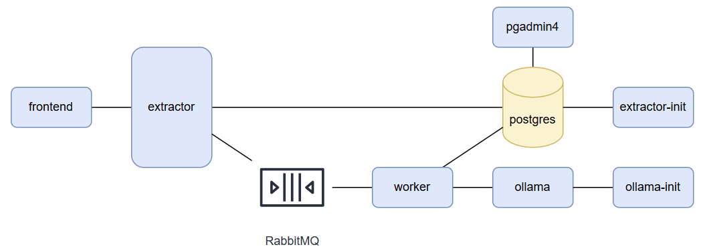

# AI-Epub-Summarizer

A tool designed to accelerate the learning process. You upload your EPUB file, and it delivers a chapter-by-chapter summary using AI.


## architecture



## start proccess (local)

- add first user with `localhost:3000/seed`

- build all project

```sh
docker compose up --build
```